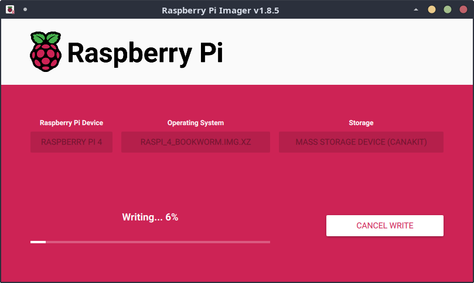

# <a name="HedgehogRaspiBuild"></a>Appendix B - Generating a Raspberry Pi Image

Hedgehog Linux can [also be built]({{ site.github.repository_url }}/tree/{{ site.github.build_revision }}/sensor-raspi) for the Raspberry Pi platform, although this capability is still considered experimental.

* [Building the Image](#HedgehogRaspiBuild)
* [Writing the Image to Flash Media](#HedgehogRaspiBurn)
* [Setting the `root` and `sensor` Passwords](#HedgehogRaspiPassword)
* [Configuration](#HedgehogRaspiConfig)
* [Performance Considerations](#HedgehogRaspiPerformance)

## Building the Image

Official downloads of the Hedgehog Linux Raspberry Pi image are not provided: however, it can be built easily on an internet-connected Linux host with Vagrant:

* [Vagrant](https://www.vagrantup.com/)
    - [`vagrant-sshfs`](https://github.com/dustymabe/vagrant-sshfs) plugin
    - [`bento/debian-12`](https://app.vagrantup.com/bento/boxes/debian-12) Vagrant box

The build should work with either the [VirtualBox](https://www.virtualbox.org/) provider or the [libvirt](https://libvirt.org/) provider:

* [VirtualBox](https://www.virtualbox.org/) [provider](https://www.vagrantup.com/docs/providers/virtualbox)
    - [`vagrant-vbguest`](https://github.com/dotless-de/vagrant-vbguest) plugin
* [libvirt](https://libvirt.org/) 
    - [`vagrant-libvirt`](https://github.com/vagrant-libvirt/vagrant-libvirt) provider plugin
    - [`vagrant-mutate`](https://github.com/sciurus/vagrant-mutate) plugin to convert [`bento/debian-12`](https://app.vagrantup.com/bento/boxes/debian-12) Vagrant box to `libvirt` format

To perform a clean build the Hedgehog Linux Raspberry Pi image, navigate to your local [Malcolm]({{ site.github.repository_url }}/) working copy and run:

```
$ ./sensor-raspi/build_via_vagrant.sh -f -z
…
Starting build machine...
Bringing machine 'vagrant-hedgehog-raspi-build' up with 'virtualbox' provider...
…
```

As this build process is cross-compiling for the ARM64 architecture, building the image is likely to take more than five hours depending on your system. As the build finishes, you will see the following message indicating success:

```
…
2024-01-21 05:11:44 INFO All went fine.
2024-01-21 05:11:44 DEBUG Ending, all OK
…
```

## <a name="HedgehogRaspiBurn"></a>Writing the Image to Flash Media

The resulting `.img.xz` file can be written to a microSD card using the [Raspberry Pi Imager](https://www.raspberrypi.com/documentation/computers/getting-started.html#raspberry-pi-imager) or `dd`.



## <a name="HedgehogRaspiPassword"></a>Setting the `root` and `sensor` Passwords

The provided image will allow login (requiring physical access) with the `sensor` account using a default password of `Hedgehog_Linux` or the `root` account with a default password of `Hedgehog_Linux_Root`. It is **highly** recommended for users to use the `passwd` utility to change both of these passwords prior to configuring networking on the device.

```

                       ,cc:,..           .:'
                      :dddddddoc,.  ;,.  oddo:.   .c;.
                      :dddddddddddo;:ddc:dddddd;  ldddl,
                      .dddddddddddddddddxdddddddo:odddddo'  cl;.
            ........   :ddddddddddddddddOkdddddddddxdddddd;,dddd'
        .;lddddddddddolcddddddddddddddddk0kddddddddOxdddddddddddo.
       'dddddddddddddddddxkdddddddddddddx00xdddddddxkddddddoodddd,
       .odddddddddddddddddO0OxdddddddddddO0Oddddddddoccloddc':xxd;
        .:dddddddddddddddddxO00kdddddddddx00kdddddo;'....',;,'dddc.    .,;,.
          .cdddxOkkxdddddddddxO00kddddddddO00ddddo,..cxxxl'...........;O0000:
   .',,,,,,':ddddkO00OxddddddddxO00kdddddddOOddddc...l0000l............',o0c
   cddddddddddddddddxO00kddddddddx000xdddddddddddo'...:dxo,..............''
    'lddddddddddddddddxO0Odddddddddk00xdddddddddddc'......................
      'lddddddddddddddddddddddddddddxkdddddddddddddl,.............':lc:;.
        .:dxkkkxxddddddddddddddddddddocc:;;;;;;;::cll,............,:,...
    ;clooooddxkOOOdddoc:;,'''',:ooc;'.................................
    odddddddddddddl:,...........'...................................
     cdddddddddl:'.............................................
      .,coddoc,...........................................
           .'...........................................
           ............................................
           .................    .............  ........
          ..................       ..........   .......
         ..........  ......          ........    ......
        ........     .....             ......     ....
        .....        ....                ....       ..

     HH   HH   EEEE  DDDDD    GGGGG    EEEE  HH   HH   OOOO    GGGGG
     HH   HH  EE     DD  DD  GG       EE     HH   HH  OO  OO  GG
     HHHHHHH  EEEEE  DD   DD GGGGGGG  EEEEE  HHHHHHH OO    OO GGGGGGG
     HH   HH  EE     DD  DD  GG   GG  EE     HH   HH  OO  OO  GG   GG
     HH   HH   EEEE  DDDDD    GGGGGG   EEEE  HH   HH   OOOO    GGGGGG

                LL      II   NN  NN   UU  UU   XX XX
                LL      II   NNN NN   UU  UU    XXX
                LL      II   NN NNN   UU  UU    XXX
                LLLLL   II   NN  NN    UUUU    XX XX

Hedgehog-rpi-4 login: sensor
Password:

sensor@Hedgehog-rpi-4:~$ su -
Password:
root@Hedgehog-rpi-4:~# passwd
New password:
Retype new password:
passwd: password updated successfully
root@Hedgehog-rpi-4:~# passwd sensor
New password:
Retype new password:
passwd: password updated successfully
```

## <a name="HedgehogRaspiConfig"></a>Configuration

Once Hedgehog Linux has booted, [configuration](malcolm-hedgehog-e2e-iso-install.md#HedgehogInstallAndConfig) can proceed as usual using the `configure-interfaces` and `configure-capture` tools.

## <a name="HedgehogRaspiPerformance"></a>Performance Considerations

While these instructions will build an image for various Raspberry Pi models, Hedgehog Linux resource requirements will likely only be satisfied by the 8GB versions of the Raspberry Pi model 4 and higher.

Using faster storage (e.g., SATA solid-state drive connected to the Pi's USB 3.0 port using a USB 3.0 SATA to USB adapter, NVMe M.2 SSD, etc.) for the Hedgehog Linux OS drive and capture artifact directories will result in much better performance than booting from a microSD card.

Users wishing to push the performance of Hedgehog Linux on Raspberry Pi may be required to disable certain features in order to operate within the constraints imposed by the Pi's available resources. For example the **ClamAV** engine used in [file extraction and scanning](malcolm-hedgehog-e2e-iso-install.md#HedgehogZeekFileExtraction) consumes a large percentage of a Raspberry Pi's system memory and could be disabled to make available those resources for other processes. Further resources could be freed up by disabling [`arkime-capture`](malcolm-hedgehog-e2e-iso-install.md#Hedgehogarkime-capture) (unselecting it from the [autostart services](malcolm-hedgehog-e2e-iso-install.md#HedgehogConfigAutostart)) which would allow Hedgehog Linux to still provide network traffic metadata generated by Zeek and Suricata at the cost of not generating Arkime session records and not storing the underlying full PCAP.