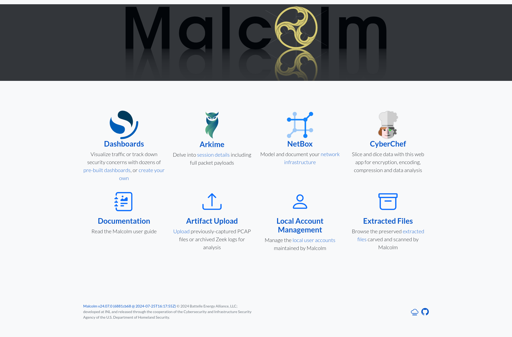

# <a name="QuickStart"></a>Quick start

* [Quick start](#QuickStart)
    - [Getting Malcolm](#GetMalcolm)
    - [User interface](#UserInterfaceURLs)

## <a name="GetMalcolm"></a>Getting Malcolm

For a `TL;DR` example of downloading, configuring, and running Malcolm in Docker on a Linux platform, see **[Installation example using Ubuntu 22.04 LTS](ubuntu-install-example.md#InstallationExample)**.

For a more in-depth guide convering installing both Malcolm and a [Hedgehog Linux](hedgehog.md) sensor using the [Malcolm installer ISO](malcolm-iso.md#ISO) and [Hedgehog Linux installer ISO](hedgehog-installation.md#HedgehogInstallation), see **[End-to-end Malcolm and Hedgehog Linux ISO Installation](malcolm-hedgehog-e2e-iso-install.md#InstallationExample)**.

### Source code

The files required to build and run Malcolm are available on its [GitHub page]({{ site.github.repository_url }}/tree/{{ site.github.build_revision }}). Malcolm's source-code is released under the terms of the Apache License, Version 2.0 (see [`LICENSE.txt`]({{ site.github.repository_url }}/blob/{{ site.github.build_revision }}/LICENSE.txt) and [`NOTICE.txt`]({{ site.github.repository_url }}/blob/{{ site.github.build_revision }}/NOTICE.txt) for the terms of its release).

### Building Malcolm from scratch

The `build.sh` script can build Malcolm's Docker images from scratch. See [Building from source](development.md#Build) for more information.

### Initial configuration

The scripts to control Malcolm require Python 3. The [`install.py`](malcolm-config.md#ConfigAndTuning) script requires the [dotenv](https://github.com/theskumar/python-dotenv), [requests](https://docs.python-requests.org/en/latest/) and [PyYAML](https://pyyaml.org/) modules for Python 3, and will make use of the [pythondialog](https://pythondialog.sourceforge.io/) module for user interaction (on Linux) if it is available.

You must run [`auth_setup`](authsetup.md#AuthSetup) prior to pulling Malcolm's Docker images. You should also ensure your system configuration and Malcolm settings are tuned by running `./scripts/install.py` and `./scripts/configure` (see [Malcolm Configuration](malcolm-config.md#ConfigAndTuning)).
    
### Pull Malcolm's Docker images

Malcolm's Docker images are periodically built and hosted on [GitHub](https://github.com/orgs/idaholab/packages?repo_name=Malcolm). If you already have [Docker](https://www.docker.com/) and [Docker Compose](https://docs.docker.com/compose/), these prebuilt images can be pulled by navigating into the Malcolm directory (containing the `docker-compose.yml` file) and running `docker compose --profile malcolm pull` like this:
```
$ docker compose --profile malcolm pull
Pulling api               ... done
Pulling arkime            ... done
Pulling dashboards        ... done
Pulling dashboards-helper ... done
Pulling file-monitor      ... done
Pulling filebeat          ... done
Pulling freq              ... done
Pulling htadmin           ... done
Pulling logstash          ... done
Pulling netbox            ... done
Pulling netbox-postgresql ... done
Pulling netbox-redis      ... done
Pulling nginx-proxy       ... done
Pulling opensearch        ... done
Pulling pcap-capture      ... done
Pulling pcap-monitor      ... done
Pulling suricata          ... done
Pulling upload            ... done
Pulling zeek              ... done
```

You can then observe the images have been retrieved by running `docker images`:
```
$ docker images
REPOSITORY                                                     TAG               IMAGE ID       CREATED      SIZE
ghcr.io/idaholab/malcolm/api                                   24.04.0           xxxxxxxxxxxx   3 days ago   158MB
ghcr.io/idaholab/malcolm/arkime                                24.04.0           xxxxxxxxxxxx   3 days ago   816MB
ghcr.io/idaholab/malcolm/dashboards                            24.04.0           xxxxxxxxxxxx   3 days ago   1.02GB
ghcr.io/idaholab/malcolm/dashboards-helper                     24.04.0           xxxxxxxxxxxx   3 days ago   184MB
ghcr.io/idaholab/malcolm/file-monitor                          24.04.0           xxxxxxxxxxxx   3 days ago   588MB
ghcr.io/idaholab/malcolm/file-upload                           24.04.0           xxxxxxxxxxxx   3 days ago   259MB
ghcr.io/idaholab/malcolm/filebeat-oss                          24.04.0           xxxxxxxxxxxx   3 days ago   624MB
ghcr.io/idaholab/malcolm/freq                                  24.04.0           xxxxxxxxxxxx   3 days ago   132MB
ghcr.io/idaholab/malcolm/htadmin                               24.04.0           xxxxxxxxxxxx   3 days ago   242MB
ghcr.io/idaholab/malcolm/logstash-oss                          24.04.0           xxxxxxxxxxxx   3 days ago   1.35GB
ghcr.io/idaholab/malcolm/netbox                                24.04.0           xxxxxxxxxxxx   3 days ago   1.01GB
ghcr.io/idaholab/malcolm/nginx-proxy                           24.04.0           xxxxxxxxxxxx   3 days ago   121MB
ghcr.io/idaholab/malcolm/opensearch                            24.04.0           xxxxxxxxxxxx   3 days ago   1.17GB
ghcr.io/idaholab/malcolm/pcap-capture                          24.04.0           xxxxxxxxxxxx   3 days ago   121MB
ghcr.io/idaholab/malcolm/pcap-monitor                          24.04.0           xxxxxxxxxxxx   3 days ago   213MB
ghcr.io/idaholab/malcolm/postgresql                            24.04.0           xxxxxxxxxxxx   3 days ago   268MB
ghcr.io/idaholab/malcolm/redis                                 24.04.0           xxxxxxxxxxxx   3 days ago   34.2MB
ghcr.io/idaholab/malcolm/suricata                              24.04.0           xxxxxxxxxxxx   3 days ago   278MB
ghcr.io/idaholab/malcolm/zeek                                  24.04.0           xxxxxxxxxxxx   3 days ago   1GB
```

### Import from pre-packaged tarballs

Once built, the `malcolm_appliance_packager.sh` script can be used to create pre-packaged Malcolm tarballs for import on another machine. See [Pre-Packaged Installation Files](development.md#Packager) for more information.

## Starting and stopping Malcolm

Use the scripts in the `scripts/` directory to start and stop Malcolm, view debug logs of a currently running
instance, wipe the database and restore Malcolm to a fresh state, etc.

## <a name="UserInterfaceURLs"></a>User interface

A few minutes after starting Malcolm (probably 5 or so for Logstash to be completely loaded, depending on the system), the following services will be accessible:

* Malcolm Landing Page: **https://localhost/**
* [Arkime](https://arkime.com/): **https://localhost/arkime/**
* [OpenSearch Dashboards](https://opensearch.org/docs/latest/dashboards/index/): **https://localhost/dashboards/**
* [Network Traffic Artifact Upload (Web)](upload.md#Upload): **https://localhost/upload/**
* [Network Traffic Artifact Upload (SFTP)](upload.md#Upload): `sftp://<username>@127.0.0.1:8022/files`
* [NetBox](asset-interaction-analysis.md#AssetInteractionAnalysis): **https://localhost/netbox/**
* [Account Management](authsetup.md#AuthBasicAccountManagement): **https://localhost/auth/**

